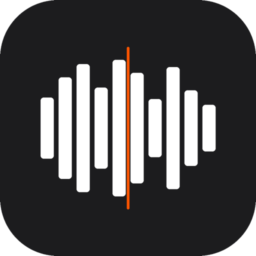

<p align="center">
  
</p>

# SampleByte

> A producer's sample workstation for hardware instruments.

[](https://github.com/RubenGlez/samplebyte/releases/latest)

SampleByte is an open-source desktop app built to handle the full workflow from finding audio to loading a finished sample pack onto your hardware. No more jumping between tools.

---

## Why I built this

I produce music in my free time and own a Roland SP-404. Every time I wanted to load new samples onto it, I'd go through the same painful loop: find audio, download it with a separate tool, trim it in Audacity, rename files to match the SP-404's naming convention, copy everything to the SD card. Half an hour of friction before I even started making something.

So I built one app that does all of it:

```
Discover -> Chop -> Organise -> Export to your sampler
```

This is not a commercial product. It's open source, free to use, and built in my spare time. If it saves you some time, a coffee goes a long way.

---

## What It Does

- **Chop:** load any local audio file or search Freesound, mark chops directly on the waveform, name them — chops save automatically; auto-chop uses spectral flux analysis with beat-snap and grid modes, and can identify loop candidates in longer files; the Stems tool splits a source into Drums, Bass, Vocals, and Other (everything else) entirely offline, so you can chop a single instrument on its own
- **Library:** browse everything you've ever sampled, search and filter by BPM, key, or tag, preview with a click — each row shows a waveform miniature
- **Import:** point at a folder of audio files and import them in bulk — BPM and key are detected automatically, duplicates are skipped
- **Pack:** drag samples onto a 4x4 pad grid, pick your hardware target, export a ready-to-load folder with correctly named and formatted files

---

## Supported Hardware

| Device | Format | Sample Rate | Bit Depth |
|---|---|---|---|
| Maschine MK3 | WAV | 44.1 kHz | 16-bit |
| Roland SP-404 MkII | WAV | 48 kHz | 16-bit |
| Akai MPC One | WAV | 44.1 kHz | 24-bit |
| Generic WAV | WAV | 44.1 kHz | 24-bit |

Every profile exports up to 16 pads today.

Adding a new hardware target is just one config object in `electron/main/hardware/profiles.ts`, no other changes needed.

---

## Audio Sources

- **Local files:** drag and drop any audio file (WAV, MP3, FLAC, AIFF, OGG)
- **Freesound:** search 650,000+ Creative Commons sounds directly in the app — category shortcut chips (Kick, Snare, Hi-Hat, 808, etc.) on the empty state let you jump in fast, and sort/duration pill filters re-run the query instantly. Loading a result opens the high-quality **preview** (~128 kbps MP3) in Chop; original-quality downloads (which need OAuth) are a planned follow-up. License and author are stored with any chops you keep and written to a `credits.txt` when you export a pack, so you can honour CC attribution.

No YouTube. Not because it isn't useful (the original version of this app was built around it), but building on top of bypassing another platform's ToS is a dead end. Freesound covers discovery legally and with solid content. Local files cover everything else.

---

## Download

Pre-built installers are on the [Releases](https://github.com/RubenGlez/samplebyte/releases) page.

| Platform | File |
|---|---|
| macOS | `.dmg` |
| Windows | `.exe` (NSIS installer) |

### macOS

SampleByte is signed with a Developer ID certificate and notarized by Apple, so it opens
by double-clicking with no Gatekeeper warning.

> Older releases (v0.0.26 and earlier) were unsigned. If you have one of those and macOS
> blocks it, either upgrade to the latest release or run `xattr -cr /Applications/SampleByte.app`.

### macOS: startup diagnostics

If the packaged app shows a JavaScript error before the main window opens, check:

```bash
cat ~/Library/Logs/samplebyte/main.log
```

The app also writes an emergency startup log to `/tmp/samplebyte-main.log`.

### Windows: SmartScreen warning

Click "More info" then "Run anyway" to get past the unsigned-app warning.

---

## Privacy

SampleByte reports anonymous usage data to [PostHog](https://posthog.com) so I can see roughly how many people use it and fix crashes I can't reproduce locally. It is **on by default** and limited to:

- a randomly generated, anonymous install ID (no account, no name, no email)
- an `app_opened` event
- unhandled errors and crashes, including their error message and stack trace

Your audio, file names, sample library, and Freesound key never leave your machine. Note that a crash's stack trace can contain file paths.

To turn it off, open **Settings** (the gear in the toolbar) and switch off **Share anonymous usage data**. The choice is saved to `settings.json` (`telemetry_enabled`) and takes effect immediately.

---

## Keyboard Shortcuts

| Key | Action |
|---|---|
| `⌘K` | Open the command palette |
| `Space` | Play / Pause |
| `Backspace` | Delete selected chop |
| `↑ / ↓` | Select previous / next chop |
| `⌘Z` / `⇧⌘Z` | Undo / Redo chop edits |
| `Mouse wheel` | Zoom waveform |

On Windows and Linux, use `Ctrl` in place of `⌘` (the app shows the right label per platform).

---

## Building from source

Requires the current Node.js LTS and [pnpm](https://pnpm.io/). A native toolchain is needed for the `postinstall` step, which rebuilds `better-sqlite3` against Electron's ABI ([node-gyp prerequisites](https://github.com/nodejs/node-gyp#installation)).

```bash
pnpm install          # installs deps and runs electron-rebuild
pnpm dev              # launch the app (creates the SQLite DB on first run)
pnpm test             # vitest (audio-rendering suites run against real ffmpeg)
pnpm tsc && pnpm lint # typecheck + lint
```

The Chop tab's Stems tool needs a vendored model that is not in git; run `pnpm fetch:stem-model` once before `pnpm build` if you want that feature in a packaged build. `pnpm seed` loads demo projects/packs (run `pnpm dev` at least once first). See [AGENTS.md](AGENTS.md) for deeper contributor notes.

---

## Acknowledgments

- [WaveSurfer.js](https://wavesurfer-js.org/) for waveform visualisation
- [Freesound](https://freesound.org/) for the Creative Commons audio API
- [Electron](https://www.electronjs.org/) for the cross-platform runtime

---

MIT, see [LICENSE](LICENSE). Built by [@RubenGlez](https://github.com/RubenGlez).
